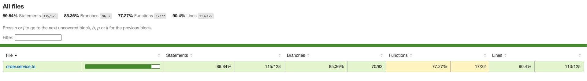
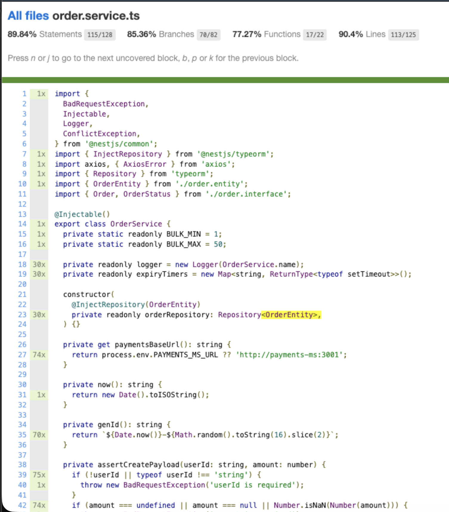
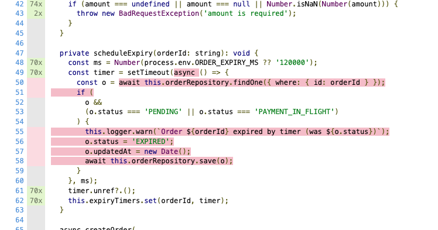
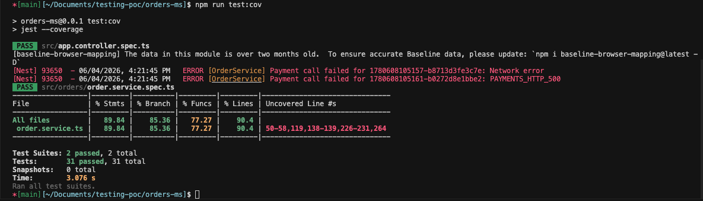

# Wiki — Taller de Pruebas Unitarias (orders-ms)

---

## Glosario

En las tablas se utilizan las siguientes abreviaturas.


| Abreviatura | Nombre completo               | Qué significa en la práctica                                                                                                                                                                                                                                                        |
| ----------- | ----------------------------- | ----------------------------------------------------------------------------------------------------------------------------------------------------------------------------------------------------------------------------------------------------------------------------------- |
| **CE**      | **Clase de equivalencia**     | **Grupo de entradas** que el programa trata **de la misma forma**. Al probar un caso representativo del grupo (éxito o fallo), no es necesario repetir todas las variantes de esa clase. Ejemplo: los `userId` vacíos (`''`, solo espacios) pertenecen a la misma clase «inválido». |
| **VL**      | **Valor límite**              | Dato situado en el **borde** entre dos clases, donde suelen aparecer defectos. Ejemplo: el bulk permite 1–50; los límites son **1** (mínimo válido), **50** (máximo válido), **0** y **51** (inmediatamente fuera del rango).                                                       |
| **R1, R2…** | **Regla de negocio**          | Requisito que el sistema debe cumplir (ver tabla de reglas). Cada prueba debe proteger al menos una regla.                                                                                                                                                                          |
| **NF**      | **Not Found** (no encontrado) | La orden u otro recurso **no existe** en base de datos; el sistema debe responder con error y no inventar datos.                                                                                                                                                                    |


## Inicio

### Dominio

Microservicio de **órdenes** del sistema Order & Payment: crear y consultar órdenes, integrar pagos síncronos con `payments-ms`, cancelar, reintentar pagos, bulk, reembolsos, ledger y metadata.

La lógica de negocio concentrada para pruebas unitarias está en:

- `[src/orders/order.service.ts](../src/orders/order.service.ts)` — servicio bajo prueba
- `[src/orders/order.service.spec.ts](../src/orders/order.service.spec.ts)` — suite unitaria

### Alcance del taller


| Incluido                            | Excluido (esta entrega)                      |
| ----------------------------------- | -------------------------------------------- |
| Pruebas unitarias de `OrderService` | Pruebas E2E de controladores                 |
| Mocks de TypeORM y `axios`          | PostgreSQL real en unitarios                 |
| TDD, AAA, CE, VL, BDD documentados  | `main.ts`, módulos, controllers en cobertura |


## TDD (Red → Green → Refactor)

### Ciclo 1 — `userId` obligatorio


| Fase         | Descripción                                                                                                            |
| ------------ | ---------------------------------------------------------------------------------------------------------------------- |
| **RED**      | Escribir `[shouldRejectCreateWhenUserIdIsEmpty](../src/orders/order.service.spec.ts)` esperando `BadRequestException`. |
| **GREEN**    | Validación en `[assertCreatePayload](../src/orders/order.service.ts)`.                                                 |
| **REFACTOR** | Mantener un único método privado para validar creación.                                                                |


### Ciclo 2 — Cancelación solo en `PENDING`


| Fase         | Descripción                                                                                     |
| ------------ | ----------------------------------------------------------------------------------------------- |
| **RED**      | Escribir `[shouldRejectCancelWhenStatusIsNotPending](../src/orders/order.service.spec.ts)`.     |
| **GREEN**    | `[cancelOrder](../src/orders/order.service.ts)` lanza `ConflictException` si no está `PENDING`. |
| **REFACTOR** | Agrupar pruebas en `describe('cancelOrder')`.                                                   |


### Ciclo 3 — Límite bulk (50)


| Fase         | Descripción                                                                            |
| ------------ | -------------------------------------------------------------------------------------- |
| **RED**      | Escribir `[shouldRejectBulkWhenCountIsFiftyOne](../src/orders/order.service.spec.ts)`. |
| **GREEN**    | Validar rango en `[bulkCreate](../src/orders/order.service.ts)`.                       |
| **REFACTOR** | Extraer `BULK_MIN` y `BULK_MAX` como constantes de clase.                              |


### Ciclo 4 (adicional) — Pago rechazado


| Fase         | Descripción                                                                          |
| ------------ | ------------------------------------------------------------------------------------ |
| **RED**      | `[shouldSetStatusFailedWhenPaymentIsDeclined](../src/orders/order.service.spec.ts)`. |
| **GREEN**    | Rama `DECLINED` en `[executePaymentAttempt](../src/orders/order.service.ts)`.        |
| **REFACTOR** | Helpers `mockPaymentApproved` / `mockPaymentDeclined` en el spec.                    |


## Patrón AAA (Arrange – Act – Assert)

### Pautas usadas

1. Separar cada prueba en tres bloques con comentarios `// Arrange`, `// Act`, `// Assert`.
2. Preparar mocks de pago y repositorio en Arrange; no mezclar aserciones en Act.
3. Reutilizar helpers (`mockPaymentApproved`, `buildRepoMock`) solo en Arrange.
4. Una responsabilidad por prueba (un comportamiento / una regla).

### Ejemplo real (enlace al código)

Prueba: `[shouldCreateOrderWhenPaymentIsApproved](../src/orders/order.service.spec.ts)`

```typescript
// Arrange
mockPaymentApproved('pay-1');

// Act
const order = await service.createOrder('user1', 100);

// Assert
expect(order.status).toBe('PAID');
expect(order.userId).toBe('user1');
```

Configuración Nest: `Test.createTestingModule` + `getRepositoryToken(OrderEntity)` + `jest.mock('axios')`.

---

## Clases de equivalencia y valores límite

### Glosario breve


| Sigla  | Significado                                                          |
| ------ | -------------------------------------------------------------------- |
| **CE** | Clase de equivalencia: entradas con el mismo comportamiento esperado |
| **VL** | Valor límite: dato en el borde entre clases válidas e inválidas      |


### Justificación de bordes — bulk `count` (R11)


| Valor  | Tipo | Justificación                                                                   |
| ------ | ---- | ------------------------------------------------------------------------------- |
| **0**  | VL   | Inmediatamente debajo del mínimo permitido (1)                                  |
| **1**  | VL   | Mínimo válido                                                                   |
| **50** | VL   | Máximo válido                                                                   |
| **51** | VL   | Inmediatamente por encima del máximo; error frecuente en validación `<=` vs `<` |


Constantes en código: `BULK_MIN = 1`, `BULK_MAX = 50` en `[order.service.ts](../src/orders/order.service.ts)`.

### Justificación — validación de creación (R1, R2)


| Entrada         | Clase       | Borde             |
| --------------- | ----------- | ----------------- |
| `userId = ''`   | CE inválido | Cadena vacía      |
| `amount = null` | CE inválido | Ausencia de valor |
| `amount = NaN`  | CE inválido | No numérico       |


---

## Matriz de pruebas


| Clase / VL               | Entrada representativa | Resultado esperado    | Prueba (`order.service.spec.ts`)                  |
| ------------------------ | ---------------------- | --------------------- | ------------------------------------------------- |
| CE válido + pago OK      | user1, 100, APPROVED   | `PAID`                | `shouldCreateOrderWhenPaymentIsApproved`          |
| CE pago rechazado        | DECLINED               | `FAILED`              | `shouldSetStatusFailedWhenPaymentIsDeclined`      |
| CE error red             | axios reject           | `FAILED`              | `shouldSetStatusFailedWhenPaymentNetworkFails`    |
| CE userId inválido       | `userId=''`            | `BadRequestException` | `shouldRejectCreateWhenUserIdIsEmpty`             |
| CE amount nulo           | `amount=null`          | `BadRequestException` | `shouldRejectCreateWhenAmountIsNull`              |
| CE amount NaN            | `amount=NaN`           | `BadRequestException` | `shouldRejectCreateWhenAmountIsNaN`               |
| CE HTTP 5xx              | status 500             | `FAILED`              | `shouldSetStatusFailedWhenPaymentHttpReturns500`  |
| CE respuesta desconocida | `PENDING_REVIEW`       | `FAILED` + error      | `shouldSetStatusFailedWhenPaymentStatusIsUnknown` |
| VL bulk bajo             | count=0                | `BadRequestException` | `shouldRejectBulkWhenCountIsZero`                 |
| VL bulk mín              | count=1                | 1 orden               | `shouldCreateBulkWhenCountIsOne`                  |
| VL bulk máx              | count=50               | 50 órdenes            | `shouldCreateBulkWhenCountIsFifty`                |
| VL bulk alto             | count=51               | `BadRequestException` | `shouldRejectBulkWhenCountIsFiftyOne`             |
| CE cancel OK             | estado `PENDING`       | `CANCELLED`           | `shouldCancelOrderWhenStatusIsPending`            |
| CE cancel conflicto      | estado `PAID`          | `ConflictException`   | `shouldRejectCancelWhenStatusIsNotPending`        |
| CE retry OK              | `FAILED` → APPROVED    | `PAID`, 2 intentos    | `shouldRetryPaymentWhenStatusIsFailed`            |


Más casos (refund, ledger, metadata, filtros): ver archivo de pruebas completo.

### Trazabilidad reglas → pruebas


| Regla   | Pruebas                                                                   |
| ------- | ------------------------------------------------------------------------- |
| R1      | `shouldRejectCreateWhenUserIdIsEmpty`                                     |
| R2      | `shouldRejectCreateWhenAmountIsNull`, `shouldRejectCreateWhenAmountIsNaN` |
| R3–R4   | `shouldCreateOrderWhenPaymentIsApproved`                                  |
| R5–R8   | pruebas de pago fallido / error / 500 / desconocido                       |
| R9–R10  | pruebas de `cancelOrder` y `retryPayment`                                 |
| R11     | pruebas bulk 0, 1, 50, 51                                                 |
| R12–R15 | refund, ledger, metadata, filtros                                         |


---

## BDD (Given – When – Then)


| Prueba                                     | Escenario                                                                                                                 |
| ------------------------------------------ | ------------------------------------------------------------------------------------------------------------------------- |
| `shouldCreateOrderWhenPaymentIsApproved`   | **Given** usuario y monto válidos y pagos aprueba, **When** se crea la orden, **Then** estado PAID y `paymentId` guardado |
| `shouldRejectCreateWhenUserIdIsEmpty`      | **Given** monto sin userId, **When** se crea, **Then** error de validación                                                |
| `shouldCancelOrderWhenStatusIsPending`     | **Given** orden pendiente, **When** se cancela, **Then** CANCELLED                                                        |
| `shouldRejectCancelWhenStatusIsNotPending` | **Given** orden pagada, **When** se cancela, **Then** conflicto de estado                                                 |
| `shouldRetryPaymentWhenStatusIsFailed`     | **Given** orden fallida, **When** se reintenta y aprueba, **Then** PAID e intentos incrementados                          |
| `shouldRejectBulkWhenCountIsFiftyOne`      | **Given** bulk de 51, **When** se valida, **Then** rechazo por límite                                                     |


---

## Resultados — Cobertura

### Comandos (equivalente a JaCoCo)

```bash
cd orders-ms
npm test
npm run test:cov
```

Reporte HTML: `orders-ms/coverage/lcov-report/index.html`.

### Métricas actuales (`order.service.ts`)

> Valores obtenidos con `npm run test:cov` (Jest/Istanbul). Si el código cambia, volver a ejecutar el comando y actualizar esta tabla.

| Métrica | Valor |
|---------|-------|
| Líneas | **90,4 %** |
| Statements | **89,84 %** |
| Branches | **85,36 %** |
| Umbral configurado | ≥ 80 % en `package.json` |

**Líneas sin cubrir (reporte Jest):** `50-58`, `119`, `138-139`, `226-231`, `264`

### Líneas sin cubrir — qué es cada bloque

| Líneas | Método / zona | Código (resumen) | Motivo |
|--------|---------------|------------------|--------|
| **50–58** | `scheduleExpiry` | Callback de `setTimeout`: busca la orden y marca `EXPIRED` | El timer no se dispara en unitarios (no se usa `jest.useFakeTimers()`). La línea 84 solo **registra** el timer; el cuerpo async (50–58) no se ejecuta. |
| **119** | `executePaymentAttempt` | `validateStatus: () => true` en `axios.post` de pagos | Callback inline que Istanbul marca aparte; el flujo de pago **sí está probado** (APPROVED, DECLINED, 500, etc.). |
| **138–139** | `executePaymentAttempt` | `PAYMENT_APPROVED_AFTER_EXPIRY` cuando `snapshotStatus === 'EXPIRED'` | Carrera pago aprobado vs orden ya expirada; depende del timer (50–58). |
| **226–231** | `getOrderLedger` | `validateStatus: () => true` en los dos `axios.get` | Misma situación que 119: el ledger **sí se prueba** en `shouldReturnLedgerWhenOrderExists`; quedan sin marcar los callbacks de configuración HTTP. |
| **264** | `requestRefund` | `validateStatus: () => true` en `axios.post` de refunds | Igual: `shouldIncrementRefundCountWhenRefundIsRequested` cubre el flujo; no la función inline del config. |

### Evidencia de cobertura (capturas)

#### 1. Resumen global — `coverage/lcov-report/index.html`

Reporte Jest/Istanbul tras `npm run test:cov`. Cobertura sobre archivos medidos de `src/` (principalmente `order.service.ts`).



#### 2. Detalle de `order.service.ts` — líneas cubiertas y sin cubrir

Vista del informe HTML con código fuente coloreado (líneas ejecutadas vs no ejecutadas).





#### 3. Ejecución de pruebas — `npm test`

Salida de terminal: 31 pruebas pasando (`order.service.spec.ts`).



---

## Gestión de defectos

Archivo oficial: `[defectos.md](../defectos.md)` (Formato 1 narrativo + Formato 2 tabla).

Resumen: defecto 01 abierto (userId con espacios); defecto 02 resuelto (validación HTTP 500).

---

## Reflexión final

### Escenarios no cubiertos y por qué

- **Expiración por timer** (`scheduleExpiry`): requiere simulación de tiempo; reservado para E2E o iteración avanzada.
- **Carrera EXPIRED + APPROVED**: depende del timer y respuestas asíncronas tardías.

### Defectos detectados por las pruebas

- Las pruebas **confirman** el manejo de HTTP 500 y estados de pago (defecto 02 cerrado).
- El análisis de R1 **sugiere** un hueco con `userId` solo espacios (defecto 01 abierto); la prueba de regresión aún no está implementada.

### Cómo mejorar `OrderService` para facilitar pruebas

1. Inyectar un cliente HTTP (`HttpService` de Nest) en lugar de `import axios` directo, para mockear vía DI.
2. Extraer la política de expiración a un servicio o puerto inyectable, para probar sin `setTimeout` real.
3. Aplicar `trim()` en validación de `userId` y cerrar el defecto 01 con su prueba.

---

## Reglas de negocio (referencia)


| ID      | Regla                               |
| ------- | ----------------------------------- |
| R1      | `userId` obligatorio                |
| R2      | `amount` obligatorio y numérico     |
| R3      | Crear → `PENDING` → pago automático |
| R4      | `APPROVED` → `PAID`                 |
| R5      | `DECLINED` → `FAILED`               |
| R6      | Error red → `FAILED`                |
| R7      | HTTP ≥ 500 → `FAILED`               |
| R8      | Respuesta desconocida → `FAILED`    |
| R9      | Cancelar solo `PENDING`             |
| R10     | Reintentar solo `FAILED`            |
| R11     | Bulk [1, 50]                        |
| R12–R15 | Refund, ledger, metadata, filtros   |


